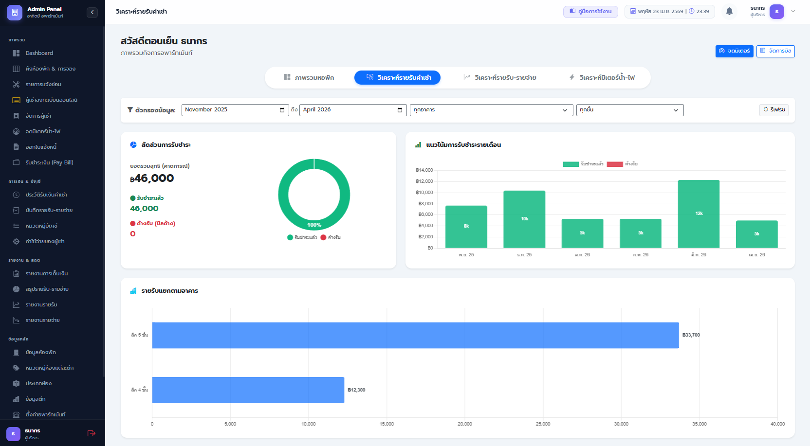
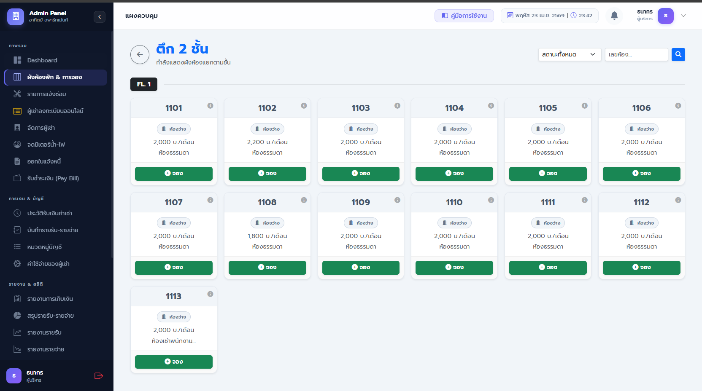
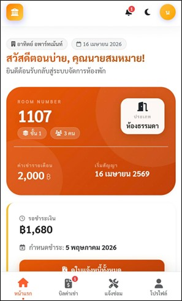

# Complete Dormitory Management System (ระบบบริหารจัดการหอพักครบวงจร)


ระบบเว็บแอปพลิเคชันสำหรับบริหารจัดการอพาร์ทเม้นท์และหอพัก ออกแบบมาเพื่อลดขั้นตอนการทำงานของแอดมิน (Automated Workflow) ครอบคลุมตั้งแต่การจัดการผู้เช่า การคำนวณค่าน้ำ-ไฟ การออกใบแจ้งหนี้ ไปจนถึงการส่งการแจ้งเตือนผ่าน LINE อัตโนมัติ

## ฟีเจอร์เด่น (Key Features)

* **Dashboard & Analytics:** แสดงภาพรวมของหอพักแบบ Real-time ด้วยกราฟ (Chart.js) เช่น สัดส่วนห้องว่าง, แนวโน้มการย้ายเข้า-ออก และสถานะบิลค้างชำระ
* **Tenant Management:** ระบบลงทะเบียนผู้เช่าใหม่, จัดการเงินมัดจำ, สิทธิการจอดรถ และประวัติการเช่า (รองรับทั้งบุคคลธรรมดาและนิติบุคคล)
* **Automated PDF Contracts:** ระบบสร้างไฟล์ PDF สัญญาเช่าอัตโนมัติ (DomPDF) พร้อมจัดเก็บลงเซิร์ฟเวอร์ทันทีเมื่อมีการอนุมัติผู้เช่า
* **Billing & Invoice System:** ระบบบันทึกการจดมิเตอร์น้ำ-ไฟ, คำนวณค่าเช่ารายเดือน, การชำระเงินบางส่วน (Partial Payment) และออกใบเสร็จรับเงิน
* **LINE API Integration:** แจ้งเตือนผู้เช่าผ่าน LINE Official Account อัตโนมัติ
  * อนุมัติการจองห้องพัก
  * สิ้นสุดสัญญาและย้ายออก
  * ออกบิลแจ้งหนี้ประจำเดือน
* **Maintenance Tracking:** ระบบรับแจ้งซ่อมและติดตามสถานะการซ่อมแซมภายในหอพัก

## เทคโนโลยีที่ใช้ (Tech Stack)

* **Backend:** PHP, Laravel Framework
* **Frontend:** HTML5, CSS3, JavaScript, Bootstrap 5, jQuery
* **Database:** MySQL
* **Libraries/Tools:** * `barryvdh/laravel-dompdf` (สำหรับสร้างไฟล์ PDF)
  * `Chart.js` (สำหรับแสดงผลกราฟสถิติ)
  * `Cleave.js` (สำหรับ Format Input เลขบัตร/เบอร์โทร)

## ภาพตัวอย่างระบบ (Screenshots)

| หน้าแดชบอร์ด (Dashboard) | หน้าจองห้องพัก (reserve Management) |
|:---:|:---:|
|  |  |
| หน้า line oa | หน้าผู้เช่า (Tenant Page) |
|:---:|:---:|
|  |  |

## การติดตั้งและทดสอบรัน (Installation)

คำแนะนำสำหรับการจำลองเซิร์ฟเวอร์เพื่อทดสอบรันบนเครื่อง Local (Local Development)

1. Clone repository นี้ลงมาที่เครื่อง
   ```bash
   git clone https://github.com/boingKung/Graduation-project-apartment-management-system.git
   cd [Folder ชื่อโปรเจกต์]
2. ติดตั้ง Dependencies ของ PHP (Composer)
    ```bash
    composer install
3. คัดลอกไฟล์ Environment และตั้งค่าฐานข้อมูล
    ```bash
    cp .env.example .env
    #(เปิดไฟล์ .env เพื่อตั้งค่า DB_DATABASE, DB_USERNAME, DB_PASSWORD และใส่ Token ของ LINE API)
4. สร้าง Application Key
    ```bash
    php artisan key:generate
5. สร้างตารางฐานข้อมูล
    ```bash
    php artisan migrate
6. เริ่มต้นจำลองเซิร์ฟเวอร์
    ```bash
    php artisan serve
    #ระบบจะทำงานอยู่ที่ http://localhost:8000

LinkedIn: www.linkedin.com/in/thanakorn-srisawat-52131539b

Email: boing100147@gmail.com

โปรเจกต์นี้เป็นส่วนหนึ่งของแฟ้มสะสมผลงาน (Portfolio) เพื่อแสดงทักษะการพัฒนา Web Application ด้วย Laravel Framework และการออกแบบ Business Logic สำหรับระบบจัดการฐานข้อมูล
